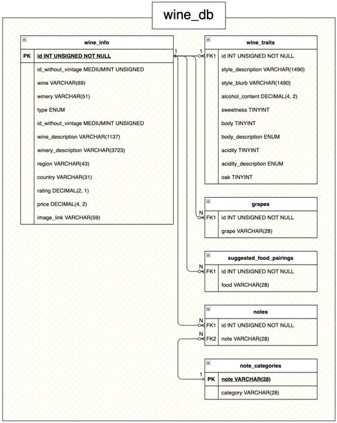

## Creating the Wine Database:

`wines.json` is populated with wine information scraped off Vivino.
 
`make_wine_tables.py` is what the outer `create_databases.py ` function runs to create the wine tables. It uses:

- `create_tables.py` to create the wine tables
- `populate_tables.py` to process the wine json data and insert it into the tables
   

`utility_functions.py` is just storage for functions I used once to gather data or other handy utility functions. Feel
free to ignore.

### Schema

### But first...

Before you begin, you have to
[set up your own MySQL server](https://dev.mysql.com/doc/mysql-getting-started/en/) *__and name it wine_db if you want
to use my default arguments__*.
 
 
Save the host/user/password/database name, because `make_wine_tables.py` takes these as optional arguments (see below)

### run `make_wine_tables.py <args>`.

This works by

- parsing `wine.json` and storing the information within the program for easy access
- creating tables in a MySQL
  database ([you have to set this up yourself beforehand, sorry :/](https://dev.mysql.com/doc/mysql-getting-started/en/))
- processing the json data so it is formatted correctly for calls to the database
- populating the wine tables with data
